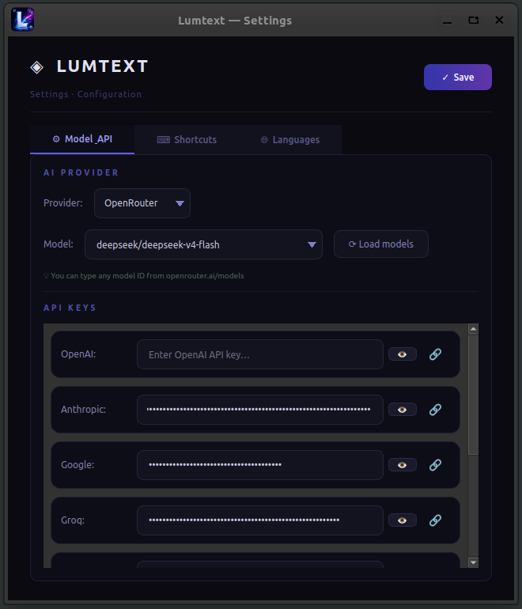
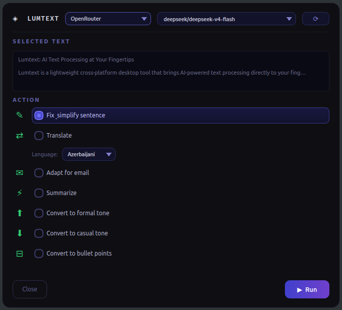
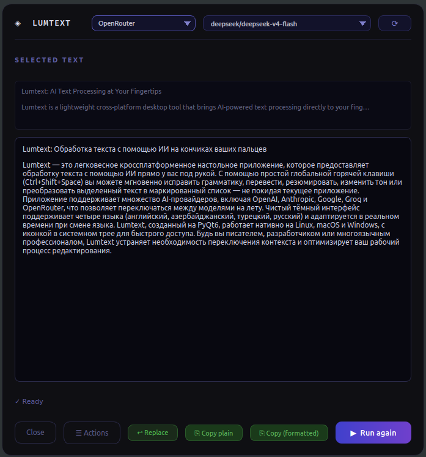

<div align="center">


# ◈ Lumtext

**AI Destekli Metin İşleme — Anında, Her Yerde**

[](https://python.org)
[](https://www.riverbankcomputing.com/software/pyqt/)
[](#-çapraz-platform)
[](#)

</div>

---

## ✨ Temel Özellikler

| # | Özellik | Açıklama |
|---|---------|----------|
| 🌐 | **Genel Kısayol** | Herhangi bir uygulamada metin seçin, `Ctrl+Shift+Space` basın — Lumtext anında açılır |
| 🤖 | **8 AI Sağlayıcı** | OpenAI, Anthropic, Google, Groq, DeepSeek, MiniMax, Kimi, OpenRouter (300+ model) |
| ✏️ | **7 Akıllı İşlem** | Dilbilgisi düzelt, çevir, özetle, e-posta için uyarla, ton değiştir, madde işaretlerine çevir |
| 🖥️ | **Sistem Tepsisi** | Arka planda sessizce çalışır — tepsinizden her an erişilebilir |
| 🔄 | **Canlı Model Listesi** | OpenRouter gerçek zamanlı model listesi yükler — 300+ model parmaklarınızın ucunda |
| 🔍 | **Çakışma Tespiti** | GNOME/KDE kısayollarını tarar, meşgul tuşları gösterir |
| 🚀 | **Otomatik Başlatma** | Sistemle birlikte otomatik başlangıç — her an hazır |
| 🌍 | **Çok Dilli Arayüz** | İngilizce, Azerbaycan Türkçesi, Türkçe, Rusça — anında geçiş |
| 📋 | **Kopyala & Değiştir** | Sonucu biçimli veya düz kopyalayın; tek tıkla seçili metni değiştirin |

---

## 💡 Neden Lumtext?

- **Basit kurulum** — bağımlılıkları yükle, çalıştır, bitti. Framework gerekmez, sadece API anahtarı.
- **AI SDK yok** — Tüm API çağrıları Python `urllib` ile. Gereksiz bağımlılık yok.
- **Her yerde çalışır** — Linux, macOS, Windows sistem tepsisi. Her iş akışına uyar.
- **Gizlilik öncelikli** — API anahtarlarınız `~/.config/lumtext/settings.json`'da kalır. Telemetri yok.
- **Karanlık tema** — uzun çalışma saatleri için göz yormaz.
- **Sürüklenebilir popup** — popup penceresini ekranda istediğiniz yere taşıyın.

---

## 📦 Gereksinimler

| Bağımlılık | Minimum Sürüm | Notlar |
|-----------|----------------|--------|
| Python | 3.10+ | |
| PyQt6 | 6.6.0+ | GUI framework |
| pynput | 1.7.6+ | Genel kısayol (macOS/Windows) |
| platformdirs | 4.0.0+ | Yapılandırma yolu çözümleme |
| xclip | *sistem* | Linux PRIMARY seçim (`apt install xclip`) |

> **AI SDK gerektirmez** — tüm sağlayıcılar Python `urllib` ile çağrılır.

---

## 🚀 Hızlı Başlangıç

### 🐧 Linux

```bash
git clone <repo-url> lumtext
cd lumtext
chmod +x install.sh
./install.sh
```

Kurulum betiği otomatik olarak:
- Python 3 ve pip'i kontrol eder, `xclip` kurar
- PyQt6 sistem bağımlılıklarını yükler (`libxcb-cursor0`, vb.)
- Bir Python sanal ortamı oluşturur
- Gerekli paketleri kurar
- Bir `.desktop` kısayolu oluşturur
- İsteğe bağlı otomatik başlatmayı etkinleştirir

**Manuel kurulum:**

```bash
python3 -m venv venv
source venv/bin/activate
pip install -r requirements.txt
python3 main.py
```

### 🍎 macOS

```bash
python3 -m venv venv
source venv/bin/activate
pip install -r requirements.txt
# İzin istendiğinde Erişilebilirlik izni verin
python3 main.py
```

### 🪟 Windows

```powershell
python -m venv venv
venv\Scripts\activate
pip install -r requirements.txt
python main.py
```

---

## 📖 Kullanım Kılavuzu

### İlk Çalıştırma

1. Lumtext'i başlatın — sistem tepsisinde mavi bir **AI** simgesi göreceksiniz
2. Tepsi simgesine sağ tıklayın → **Ayarları Aç**
3. **Model & API** sekmesine gidin
4. AI sağlayıcınızı seçin (örn. Anthropic, OpenAI)
5. API anahtarınızı girin
6. Açılır listeden bir model seçin
7. **Kaydet** düğmesine tıklayın

### Günlük Kullanım

```
1. Herhangi bir uygulamada metni seçin (tarayıcı, düzenleyici, terminal, vb.)
2. Ctrl+Shift+Space tuşlarına basın (varsayılan kısayol)
3. Seçilen metinle birlikte bir açılır pencere belirir
4. Bir işlem seçin:
   ✎   Cümleyi düzelt & sadeleştir
   ⇄   Başka bir dile çevir
   ✉   E-posta için uyarla
   ⚡  Özetle
   ⬆  Resmi üsluba dönüştür
   ⬇  Gündelik üsluba dönüştür
   ⊟  Madde işaretlerine çevir
5. ▶  Çalıştır düğmesine tıklayın
6. AI metninizi işler — sonuç açılır pencerede görünür
7. Biçimli veya düz metin kopyalayın veya "Değiştir" ile orijinali değiştirin
```

### Kısayolu Değiştirme

1. Tepsi simgesine sağ tıklayın → **Ayarları Aç**
2. **Kısayollar** sekmesine gidin
3. Sistemde kullanılan kısayolları görüntüleyin (GNOME/KDE otomatik taranır)
4. Yeni kısayolunuzu girin (biçim: `<ctrl>+<shift>+a`)
5. **Ayarla** düğmesine tıklayın
6. **Kaydet** düğmesine tıklayın

### OpenRouter (300+ Model)

1. Sağlayıcı olarak **OpenRouter** seçin
2. [OpenRouter API anahtarınızı](https://openrouter.ai/keys) girin
3. **⟳ Modelleri yükle** düğmesine tıklayın — güncel model listesi yüklenir
4. 300+ model arasında arama yapın
5. İstediğiniz model ID'sini manuel olarak yazabilirsiniz

### Harici Tetik Betiği

Kısayol çalışmazsa, `scripts/trigger.py` betiğini kendi kısayol bağlamanıza ekleyin:

```bash
python3 scripts/trigger.py
```

Bu, UNIX soketi (`/tmp/lumtext.sock`) aracılığıyla Lumtext'e sinyal gönderir.

---

## 🖼️ Ekran Görüntüleri

| | |
|---|---|
| **Ayarlar Penceresi** — sağlayıcı, API anahtarları, kısayol ve dil yapılandırması |  |
| **İşlem Popup'ı** — kısayola basınca açılan eylem seçici |  |
| **AI Sonucu** — kopyala/değiştir düğmeleriyle işlenmiş çıktı |  |

---

## 🤖 Desteklenen AI Sağlayıcıları

| Sağlayıcı | Kimlik Doğrulama | Örnek Modeller | Yapılandırma URL |
|----------|-----------------|----------------|------------------|
| **OpenAI** | Bearer Token | GPT-4o, GPT-4-turbo, GPT-3.5-turbo | [API Anahtarları](https://platform.openai.com/api-keys) |
| **Anthropic** | x-api-key | Claude Opus 4.5, Sonnet 4.5, Haiku 4.5 | [Konsol](https://console.anthropic.com/settings/keys) |
| **Google** | API Anahtarı | Gemini 2.0 Flash, 1.5 Pro, 1.5 Flash | [AI Studio](https://aistudio.google.com/apikey) |
| **Groq** | Bearer Token | Llama 3.3-70B, Llama 3.1-8B, Mixtral | [Konsol](https://console.groq.com/keys) |
| **DeepSeek** | Bearer Token | DeepSeek Chat, DeepSeek Reasoner | — |
| **MiniMax** | Bearer Token | MiniMax-Text-01, abab6.5s-chat | — |
| **Kimi** | Bearer Token | Moonshot v1 (8k/32k/128k) | — |
| **OpenRouter** | Bearer Token | 300+ model (canlı liste) | [Anahtarlar](https://openrouter.ai/keys) |

---

## ⚙️ Yapılandırma

**Dosya:** `~/.config/lumtext/settings.json`

```json
{
  "provider": "Anthropic",
  "model": "claude-sonnet-4-5",
  "hotkey": "<ctrl>+<shift>+<space>",
  "language": "English",
  "languages": ["Azerbaijani", "English", "Russian", "Turkish"],
  "theme": "dark",
  "window_position": [100, 100],
  "api_keys": {
    "openai": "sk-...",
    "anthropic": "sk-ant-..."
  }
}
```

**Ayarlar penceresi:**

| Sekme | Ayarlar |
|-------|---------|
| ⚙ **Model & API** | Sağlayıcı seçimi, model seçici, API anahtarları (gizli, göster/gizle düğmesiyle) |
| ⌨ **Kısayollar** | Mevcut kısayol, yeni kısayol girişi, sistemde kullanılan kısayollar |
| 🌐 **Diller** | Arayüz dili seçimi, çeviri dilleri (en fazla 6) |

---

## 🏗️ Mimari

```
main.py
 ├── ConfigManager          ← ~/.config/lumtext/settings.json
 ├── HotkeyManager
 │    ├── SelectionWatcher  ← PRIMARY seçim (xclip) 250ms
 │    └── TriggerListener   ← UNIX socket /tmp/lumtext.sock
 ├── ActionPopup (PyQt6)
 │    ├── AIWorker (QThread) → call_ai() → 8 sağlayıcı (urllib)
 │    └── Clipboard         ← xclip / pbcopy / win32
 └── SettingsWindow
      └── OpenRouterFetchWorker (QThread)
```

**Çalışma akışı:**

```
1. main.py sistem tepsisinde başlar
2. SelectionWatcher PRIMARY seçimi izler (Linux) veya
   genel kısayolu dinler (macOS/Windows pynput ile)
3. Kullanıcı kısayola basar → TriggerListener etkinleşir
4. Popup, seçilen metin ve işlem seçiciyle açılır
5. Kullanıcı bir işlem seçip "Çalıştır"a tıklar
6. AIWorker arka plan thread'inde AI isteğini gönderir
7. Sonuç popup'ta gösterilir — biçimli/düz kopyala, değiştir
```

---

## 🛠️ Geliştirme

```bash
git clone <repo-url>
cd lumtext
python3 -m venv venv
source venv/bin/activate
pip install -r requirements.txt
python3 main.py
```

**Proje yapısı:**

```
lumtext/
├── main.py                  # Giriş noktası
├── requirements.txt         # Python bağımlılıkları
├── install.sh               # Linux kurulum betiği
├── install_mac.sh           # macOS kurulum betiği
├── install_windows.ps1      # Windows kurulum betiği
├── ui/
│   ├── action_popup.py      # Açılır popup UI (QDialog)
│   ├── settings_window.py   # Ayarlar penceresi (QMainWindow)
│   ├── app_icon.png         # Uygulama simgesi (1024×1024)
│   ├── arrow.png            # Açılır ok (PNG)
│   └── arrow.svg            # Açılır ok (SVG)
├── core/
│   ├── ai_handler.py        # AI sağlayıcı entegrasyonu (8 sağlayıcı)
│   ├── clipboard.py         # Çapraz platform panosu (xclip/pbcopy/win32)
│   ├── config_manager.py    # JSON yapılandırma yükle/kaydet (~/.config/lumtext)
│   ├── hotkey_manager.py    # Genel kısayol + seçim izleyici
│   └── localization.py      # i18n (AZ, EN, TR, RU)
└── scripts/
    └── trigger.py           # Harici tetik (UNIX socket)
```

---

## 🌐 Diğer dillerde oku

| Dil | README |
|-----|--------|
| 🇬🇧 English | [README.md](README.md) |
| 🇦🇿 Azərbaycan dili | [README.az.md](README.az.md) |
| 🇷🇺 Русский | [README.ru.md](README.ru.md) |

---

<div align="center">

**Lumtext** — Seç. Bas. Dönüştür.

</div>
